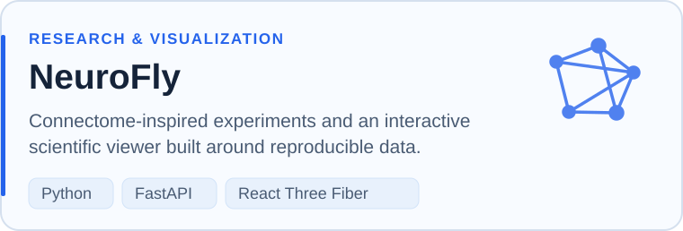
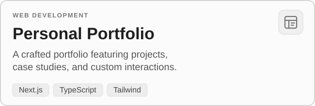
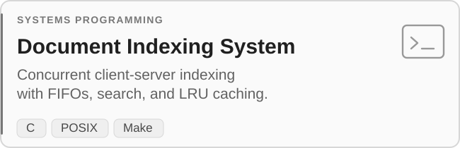
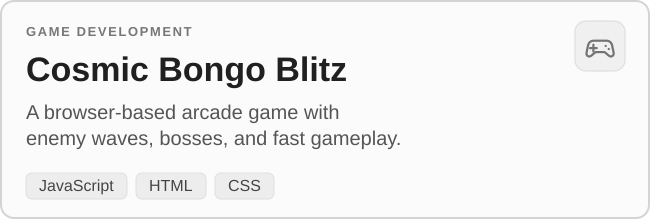

  <h1>Hélder Cruz</h1>
  
<strong>Software Engineer &nbsp;·&nbsp; Full-Stack Development</strong>

  
Building software that works — from thoughtful interfaces to reliable backend systems.

  

    &nbsp;
    &nbsp;
    &nbsp;
    
  

---

###  Engineering Focus

I'm a **Computer Engineering graduate from the University of Minho**, based in Braga, Portugal. I build full-stack applications with an emphasis on clean interfaces, maintainable architecture, and real-world usefulness.

My experience includes **frontend development in healthcare technology** and end-to-end web projects for clients. I also enjoy exploring systems programming, developer tooling, and research-oriented software.

###  Featured Projects

A selection of projects across research, web engineering, systems programming, and game development.

  <a href="https://github.com/a104174/NeuroFly"><picture><source media="(prefers-color-scheme: dark)" srcset="./assets/neurofly-dark.svg" /></picture></a> &emsp; <a href="https://github.com/a104174/heldercruz"><picture><source media="(prefers-color-scheme: dark)" srcset="./assets/portfolio-dark.svg" /></picture></a>

  <a href="https://github.com/a104174/SO-G86"><picture><source media="(prefers-color-scheme: dark)" srcset="./assets/so-g86-dark.svg" /></picture></a> &emsp; <a href="https://github.com/a104174/cosmic-bongo-blitz"><picture><source media="(prefers-color-scheme: dark)" srcset="./assets/cosmic-bongo-blitz-dark.svg" /></picture></a>

###  Selected Client Work

I design and develop digital products shaped around real needs, from initial requirements through implementation and deployment.

- **Casa Benfica Lenzburg** — Website and custom backoffice for reservations, events, menus, and internal operations.
- **XV Studio** — Digital agency website with a distinctive visual direction and guided contact experience.
- **HAUSB** — Brand-focused web experience combining clear messaging with responsive frontend engineering.

  

###  Tech Stack

- **Frontend:** Next.js, React, TypeScript, Tailwind CSS
- **Backend & data:** Node.js, FastAPI, Elixir / Phoenix LiveView, PostgreSQL, Supabase, REST APIs
- **Languages:** TypeScript, JavaScript, Python, Java, C, C++, SQL
- **Infrastructure & tools:** Git, Docker, Vercel, Cloudflare, Figma

---

  
<em>"Useful software starts with understanding people."</em>

  
<strong>Open to collaborations and software engineering opportunities.</strong>

  

